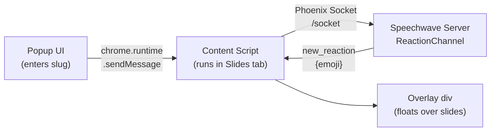

# Speechwave Chrome Extension

Chrome Manifest V3 extension for [Speechwave](https://github.com/speechwave-live/speechwave). Connects to a running talk and overlays live emoji reactions on Google Slides. Tracks the current slide number and sends it to the server so reactions can be stamped with slide context.

## How it works

The extension has two parts:

**Popup (`popup.html` + `popup.js`)** — A small UI that appears when you click the extension icon. The speaker enters the talk slug and clicks "Connect". The popup sends a message to the content script via `chrome.runtime.sendMessage`.

**Content script (`content/content.js`)** — Injected into Google Slides pages. It:

1. Connects a Phoenix `Socket` to `wss://speechwave.fly.dev/socket`
2. Joins the `reactions:${slug}` channel
3. Listens for `"new_reaction"` messages and calls `spawnEmoji()`
4. Observes the slide number DOM and sends `slide_changed` to the server



---

## Install (developer mode)

1. Open `chrome://extensions` in Chrome
2. Enable **Developer mode** (top-right toggle)
3. Click **Load unpacked** → select this repo's root directory
4. The Speechwave icon appears in the toolbar

## Connect to a talk

1. Navigate to a Google Slides presentation (`https://docs.google.com/presentation/...`)
2. Click the Speechwave extension icon
3. Enter the talk slug (e.g. `elixir-for-rubyists`)
4. Click **Connect** — the dot turns green when connected
5. Start the slideshow (**Slideshow** button or F5) — the popup will show the current slide number once the slideshow is running

The extension auto-reconnects on page reload if a slug was previously saved.

---

## Running tests

```bash
npm install
npm test        # run all Jest tests
```

---

## Pointing at a different server

The extension is hard-coded to `wss://speechwave.fly.dev` in `content/content.js`:

```javascript
const HOST = "wss://speechwave.fly.dev";
```

Change this to `ws://localhost:4000` for local testing, then:

1. Reload the extension in `chrome://extensions` (click the refresh icon)
2. **Reload the Google Slides tab** — Chrome does not re-inject content scripts into already-open tabs when an extension is updated

To debug connection issues, open Chrome DevTools on the Google Slides tab (F12) and check the **Console** for `[Speechwave]` log messages.

---

## Fireworks animation

When the crowd converges on a single emoji, a radial burst animation fires in the overlay instead of individual floaters. The trigger condition is intentionally compound:

```
count(emoji) >= FIREWORKS_MIN_COUNT  &&  count(emoji) / total_in_flight >= FIREWORKS_MIN_PERCENT
```

The absolute count guard (`MIN_COUNT = 5`) prevents bursts from firing with tiny audiences. The percentage guard (`MIN_PERCENT = 0.4`) prevents bursts from firing when the crowd is sending many different emojis — it requires this emoji to be dominant, not merely frequent. A global cooldown (`FIREWORKS_COOLDOWN_MS = 8000`) prevents back-to-back bursts, and only one burst can play at a time (`fireworksActive` flag).

The presenter can toggle fireworks on or off at any time from the **Fireworks animations** checkbox in the popup. The preference is saved to `chrome.storage.sync` (persists across devices and page reloads).

**In-flight tracking** — `spawnEmoji()` increments a per-emoji counter (`inFlight["❤️"]++`) when an element is created, and decrements it in the `animationend` listener when the element is removed. The 2.5s animation duration acts as a natural sliding window: `total_in_flight` reflects reactions from the last ~2.5 seconds, making it a real-time proxy for current crowd engagement.

**Trigger logic** is extracted to `lib/fireworks.js` as a pure function (`checkFireworksTrigger(inFlight, emoji, opts)`) that is easy to unit test with Jest without a browser environment. The file uses the same dual-export pattern as the adapter modules — `module.exports` for Jest, `window.SpeechwaveFireworks` for the browser.

The trigger thresholds (`FIREWORKS_MIN_COUNT`, `FIREWORKS_MIN_PERCENT`, `FIREWORKS_COOLDOWN_MS`) are named constants at the top of `content/content.js` and can be tuned without touching any other code.

**Burst animation** — `spawnFireworks()` creates `FIREWORKS_BURST_COUNT` (16) `<span>` elements at the overlay center, each animated outward at a unique angle using the Web Animations API:

```javascript
el.animate(
  [
    { transform: "translate(0, 0) scale(1)", opacity: 1 },
    { transform: `translate(${tx}px, ${ty}px) scale(0.3)`, opacity: 0 },
  ],
  { duration: 1200, delay, easing: "ease-out", fill: "forwards" }
);
```

The Web Animations API is used (rather than CSS `@keyframes`) because each element needs a unique computed `translate(tx, ty)` target. A safety timeout resets `fireworksActive` after 2 seconds in case `finish` events fail to fire (e.g., when the overlay is re-parented during a fullscreen transition).

**Presenter toggle** — The popup's "Fireworks animations" checkbox writes to `chrome.storage.sync` and sends a `SET_FIREWORKS` message to the content script. `content.js` reads the stored value on init so the preference survives page reloads.

> **Note:** Slide number tracking requires the slideshow to be running. The popup shows "Slide —" in the editor view because the slide indicator element only appears in the presentation iframe that Google Slides loads when the slideshow starts.

---

## Fullscreen overlay

When the speaker enters fullscreen mode in Google Slides, the browser creates a new stacking context for the fullscreen element. Any `position: fixed` elements on `<body>` become invisible. The extension handles this by re-parenting the overlay `<div>` into the fullscreen element when a `fullscreenchange` event fires:

```javascript
document.addEventListener("fullscreenchange", () => {
  const overlay = document.getElementById("speechwave-overlay");
  if (document.fullscreenElement) {
    document.fullscreenElement.appendChild(overlay); // move into fullscreen
  } else {
    document.body.appendChild(overlay);              // move back
  }
});
```

---

## Slide tracking

### Adapter registry

Different presentation tools expose the current slide number differently. The extension uses an **adapter registry** (`adapters/index.js`) that picks the right adapter based on the current page URL:

```javascript
// index.js
function getAdapter(url) {
  if (url.includes("docs.google.com/presentation")) {
    return GoogleSlidesAdapter;
  }
  return { getSlide: () => 0 };  // fallback for unknown platforms
}
```

The Google Slides adapter (`adapters/google_slides.js`) reads the slide number from the DOM:

```javascript
function getSlide() {
  const input = document.querySelector('input[aria-label*="Slide"]');
  if (!input) return 0;
  const n = parseInt(input.value, 10);
  return isNaN(n) ? 0 : n;
}
```

This is brittle by nature (Google could change the DOM), but it's the only option without a first-party API. The fixture-based Jest tests in `tests/` snapshot the relevant DOM so regressions are caught before they ship.

If Google changes the DOM, update `tests/fixtures/google_slides_dom.html` and the selector in `adapters/google_slides.js`.

### MutationObserver

The content script sets up a `MutationObserver` to watch for attribute changes on the slide input:

```javascript
function startSlideObserver() {
  const observer = new MutationObserver(() => {
    const slide = getAdapter(window.location.href).getSlide();
    if (slide !== currentSlide && slide > 0) {
      currentSlide = slide;
      channel.push("slide_changed", { slide });
    }
  });
  observer.observe(document.body, {
    subtree: true,
    attributeFilter: ["value", "aria-label"]
  });
}
```

Slide `0` is a sentinel for "unknown" and is never sent — the server silently ignores it too.

The popup also displays the current slide number in real time ("Slide 3" or "Slide —" for unknown). This serves as an immediate sanity check that the adapter is reading the DOM correctly — if the number doesn't update when you advance slides, the DOM structure has changed and the adapter selector needs updating.

---

## Troubleshooting

**Emojis appear multiple times in the overlay**

If each reaction shows up more than once in the extension overlay, the content script likely has a stale channel connection from a previous session (e.g., after the extension was reloaded or the server was restarted). **Reload the Google Slides tab** to reset the connection — this clears the old channel state and establishes a fresh one.

---

## Project structure

| Path | What it does |
|------|--------------|
| `manifest.json` | Manifest V3 config, permissions, content script |
| `popup/popup.html` | Slug input + connection status |
| `popup/popup.js` | Save slug, send to content script, show status |
| `content/content.js` | Inject overlay, connect to channel, animate emojis, fireworks spawner |
| `lib/fireworks.js` | Pure trigger logic: `checkFireworksTrigger(inFlight, emoji, opts)` |
| `adapters/index.js` | Adapter registry (returns adapter for current URL) |
| `adapters/google_slides.js` | Reads current slide number from Google Slides DOM |
| `tests/` | Jest tests for fireworks logic and adapters |
| `tests/fixtures/` | DOM snapshots for adapter tests |
